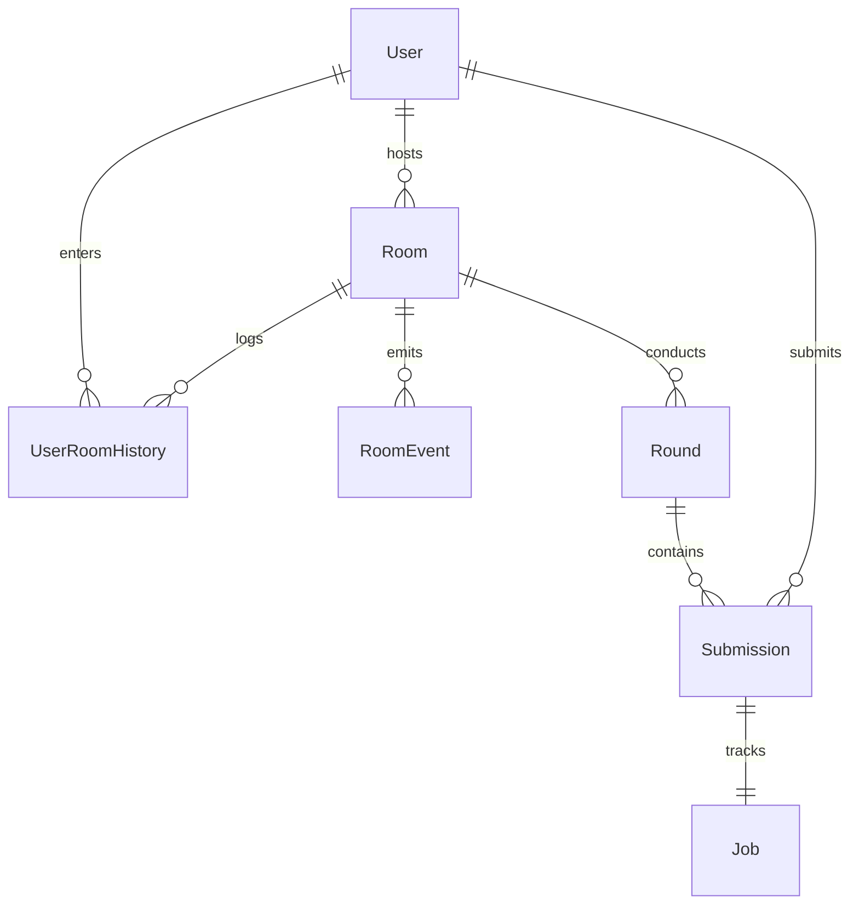
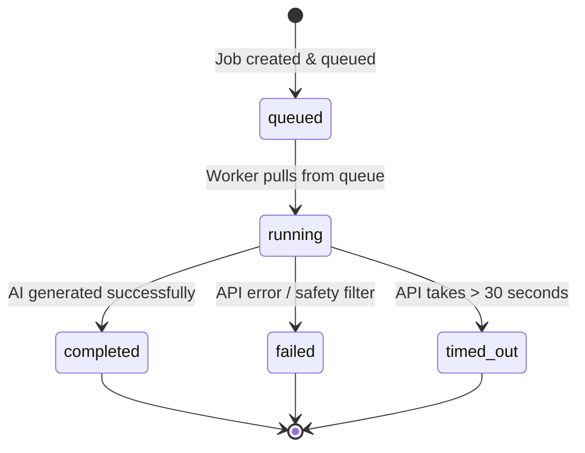

# AI Creative Battle Room — Intern Assignment Suite

Welcome to the **Poiro AI Creative Battle Room**! This is a stateful, real-time multiplayer creative battle arena where users compete in AI-powered copywriting and product design challenges. One host launches the battle rounds while participants submit prompts, which are processed asynchronously through a dedicated background task queue and generated using live LLM APIs.

The system is designed with a professional, enterprise-grade **Clean Architecture** (featuring domain-specific models, schemas, and class-based services) on the backend and a premium, responsive **React + Vite + TypeScript** dashboard styled with a high-contrast **Reddit-style Dark Theme** on the frontend.

---

## Modular Architecture Overview

The backend has been refactored from a flat file structure into an enterprise-grade modular design enforcing clean **Separation of Concerns**:

```
backend/app/
├── core/                       # Global system configurations & database engine
│   ├── config.py               # Enforces environment variable precedence
│   ├── database.py             # SQLAlchemy engine & session local providers
│   └── security.py             # Salted password hashing & JWT token generators
├── models/                     # SQLAlchemy declarative ORM models
│   ├── base.py                 # Base model declarations
│   ├── user.py                 # User domain
│   ├── room.py                 # Rooms, RoomEvents, and RoomHistory domain
│   ├── round.py                # Round domain
│   └── submission.py           # Submission & Job domain
├── schemas/                    # Pydantic data serialization schemas (DTOs)
│   ├── user.py                 # User & Token schemas
│   ├── room.py                 # Room, History, & invitation schemas
│   └── battle.py               # Round, Submission, & processing Job schemas
├── services/                   # Class-based business logic & task orchestrators
│   ├── user_service.py         # UserService class-based CRUD
│   ├── room_service.py         # RoomService class-based CRUD
│   ├── round_service.py        # RoundService class-based CRUD
│   ├── submission_service.py   # SubmissionService class-based CRUD
│   ├── ai_provider.py          # Groq Llama-3.3, OpenAI GPT-4o-mini, and Gemini
│   └── worker.py               # In-process task queue loop and WS callbacks
├── api/                        # HTTP endpoints & WebSocket handlers
│   ├── auth.py                 # Register, Login, and Me endpoints
│   ├── rooms.py                # Arena listings & details
│   ├── history.py              # Telemetry tracking for historical stats
│   └── websocket.py            # Connection managers and multiplayer websocket loops
└── main.py                     # Lightweight application bootstrap entry point
```

### Class-Based Service Pattern (OOP)
All database interactions are organized into cohesive Service classes (e.g., `UserService`, `RoomService`). These classes accept the database `Session` in their constructors (`__init__(self, db: Session)`). This decouples logic from router parameters, making database transactions highly modular and unit testing/mocking extremely straightforward.

---

## Database Schema & Entity Model

We use an **SQLite** database managed through SQLAlchemy ORM. This is the simplest database that supports transaction boundaries, relationships, and foreign keys out of the box with zero setup.



### Database Tables
1. **User**: Persists credentials, custom usernames, and customizable visual profile avatar seeds.
2. **Room**: Represents active arenas, mapping the unique 5-letter host code, active host, and arena state.
3. **UserRoomHistory**: Tracks which rooms a user has previously visited as a host or participant.
4. **RoomEvent**: A persistent event-source log auditing all telemetry actions for historical records.
5. **Round**: Tracks round status, round number, and the active creative theme (e.g. *Gen-Z perfume*).
6. **Submission**: Links the prompt input, generated creative copy, image URLs, scores, and ranks.
7. **Job**: Manages asynchronous processing status, start timestamps, and error messages.

---

## Real-time Event Model

All communication in the multiplayer battle room is orchestrated in real time via **WebSockets** under `/ws/room/{room_code}`. Messages are categorized into standard event payloads:

| Event Type | Direction | Initiator | Description |
| :--- | :--- | :--- | :--- |
| `ROOM_STATE` | Unicast (Server ➔ Client) | System | Transmits the comprehensive game, participant, and submission state upon connect/refresh. |
| `USER_JOINED` | Broadcast (Server ➔ Room) | System | Welcomes a connecting user and refreshes the live active participant list. |
| `USER_LEFT` | Broadcast (Server ➔ Room) | System | Triggers when a participant disconnects, cleaning up the lobby. |
| `ROUND_STARTED` | Broadcast (Server ➔ Room) | Host | Signals that a new round is active and submissions are accepting entries. |
| `SUBMISSION_SUBMITTED`| Broadcast (Server ➔ Room) | Participant | Signals that a prompt was submitted and an async job is queued. |
| `JOB_STATUS_UPDATED` | Broadcast (Server ➔ Room) | Worker | Updates the status of an active job (transitions to `running` or `failed`). |
| `SUBMISSION_COMPLETED`| Broadcast (Server ➔ Room) | Worker | Injects the generated campaign data and visual cues once the AI completes. |
| `ROUND_EVALUATING` | Broadcast (Server ➔ Room) | Host | Locks the submission box and starts the evaluation phase. |
| `SUBMISSION_SCORED` | Broadcast (Server ➔ Room) | Host | Synchronizes specific submission score, rank, and elimination status. |
| `ROUND_COMPLETED` | Broadcast (Server ➔ Room) | Host | Finalizes the active round status. |
| `BATTLE_COMPLETED` | Broadcast (Server ➔ Room) | Host | Closes the arena and announces the ultimate survivor. |

---

## Generation Job Lifecycle

To prevent blocking the HTTP request handler, prompt execution is offloaded to a background queue. The job flows through the following state machine:



*   **`queued`**: Prompt is persisted, and the job is inserted into `asyncio.Queue()`.
*   **`running`**: Background loop picks up the task, updates database state, and triggers AI APIs.
*   **`completed`**: Copy writing completes. The payload is JSON-parsed, saved to the database, and sent to all clients.
*   **`failed`**: The worker catches errors (e.g. prompt injection, api keys missing, safety filter block) and saves the error reason for the UI.
*   **`timed_out`**: The task is cancelled after 30.0 seconds of unresponsiveness to prevent locking the queue thread.

---

## Chosen Judging / Scoring Mechanism

### The Selected Design: Host-Led Qualitative Grading
In this implementation, the host serves as the ultimate creative judge. The host reviews campaigns, assigns numeric scores (0 to 100), gives direct ranking positions, and marks individuals as either `active` or `eliminated`.

*   **Why this was chosen**: Standard multiplayer game loops (like Jackbox Games, Quiplash, or Cards Against Humanity) thrive on peer or host judgment. It introduces human humor, subjective critiques, and social dynamics.
*   **Weaknesses**:
    1. It relies heavily on host availability. If the host becomes inactive, the room blocks.
    2. Host bias or lack of objective metrics can frustrate users.
*   **Production Improvements**:
    1. **Consensus Voting**: Allow all participants to upvote submissions, determining rank collectively.
    2. **AI Judge (Automated Consensus)**: Integrate an LLM judge utilizing a secondary agent prompt to rank inputs objectively against custom metrics (e.g. *Gen-Z vibe check*, *clarity of visual metaphor*).

---

## What is Persisted and What is Not

### Persisted (SQLite Database)
- **Users**: User credentials, salt, hashed passwords, avatar seeds.
- **Rooms & History**: Room names, unique invite codes, host linkages, and participant visit trails.
- **Rounds**: Round configurations, statuses, active themes, and order sequences.
- **Submissions & Async Jobs**: Participant prompts, generated campaign JSON strings, image visual strings, grades, and background task telemetry.
- **Activity Log**: Event-sourced logs inside `RoomEvent` to capture chronological battle events.

### Not Persisted (In-Memory Only)
- **Active WebSocket Sockets**: Maintained dynamically inside the `ConnectionManager` class in memory.
- **In-process Queue Tasks**: The background queue list `asyncio.Queue()` is managed in-memory. If the server is restarted, any currently *queued* jobs are reset (but they can be rerun since the database maintains their draft state).

---

## Failure Handling Strategy

1. **AI Failures & Fallbacks**: The `AIProvider` encapsulates OpenAI and Groq APIs inside robust `try-except` wrappers. If live keys are missing or rate-limited, it automatically falls back to an elegant, procedurally generated copywriting system so the battle room experience remains unbroken.
2. **Safety Filter Violation**: If a user tries to trigger system failures (e.g. prompt beginning with `"fail"`), the backend intercepts the request and marks the job as `failed` with a readable safety warning on the frontend card.
3. **Task Timeouts**: Integrated `asyncio.wait_for` set to a hard limit of 30.0 seconds. If an LLM endpoint takes too long, the thread is closed, and the job transitions to `timed_out`.
4. **WebSocket Recovery**: The React frontend uses an automated network drop listener and custom reconnect retry hooks to re-establish sockets, querying the server for a full `ROOM_STATE` snapshot instantly to resume without losing battle context.

---

## Step-by-Step Local Deployment Guide

### Prerequisites
*   Python 3.12+
*   Node.js 18+ & npm

### 1. Setup Backend Environment
```powershell
# Navigate to backend directory
cd backend

# Create and activate virtual environment
python -m venv venv
.\venv\Scripts\Activate.ps1

# Install dependencies
pip install -r requirements.txt

# Create your local .env configuration (or copy .env.example)
# Add your live Groq or OpenAI API key to experience real campaign generations!
```

### 2. Start Backend Server
```powershell
venv\Scripts\python -m uvicorn app.main:app --reload --host 0.0.0.0 --port 8000
```

### 3. Setup Frontend Environment
```powershell
# Navigate to frontend directory
cd ../frontend

# Install dependencies
npm install

# Start development server
npm run dev -- --host 0.0.0.0
```
Open **[http://localhost:5173](http://localhost:5173)** in your browser!

---

## Running the Test Suite
We have provided an automated, end-to-end integration test suite that tests database connections, auth tokens, background worker loops, and websocket state dispatcher loops.
```powershell
cd backend
.\venv\Scripts\Activate.ps1
pytest test_battle.py -v
```
