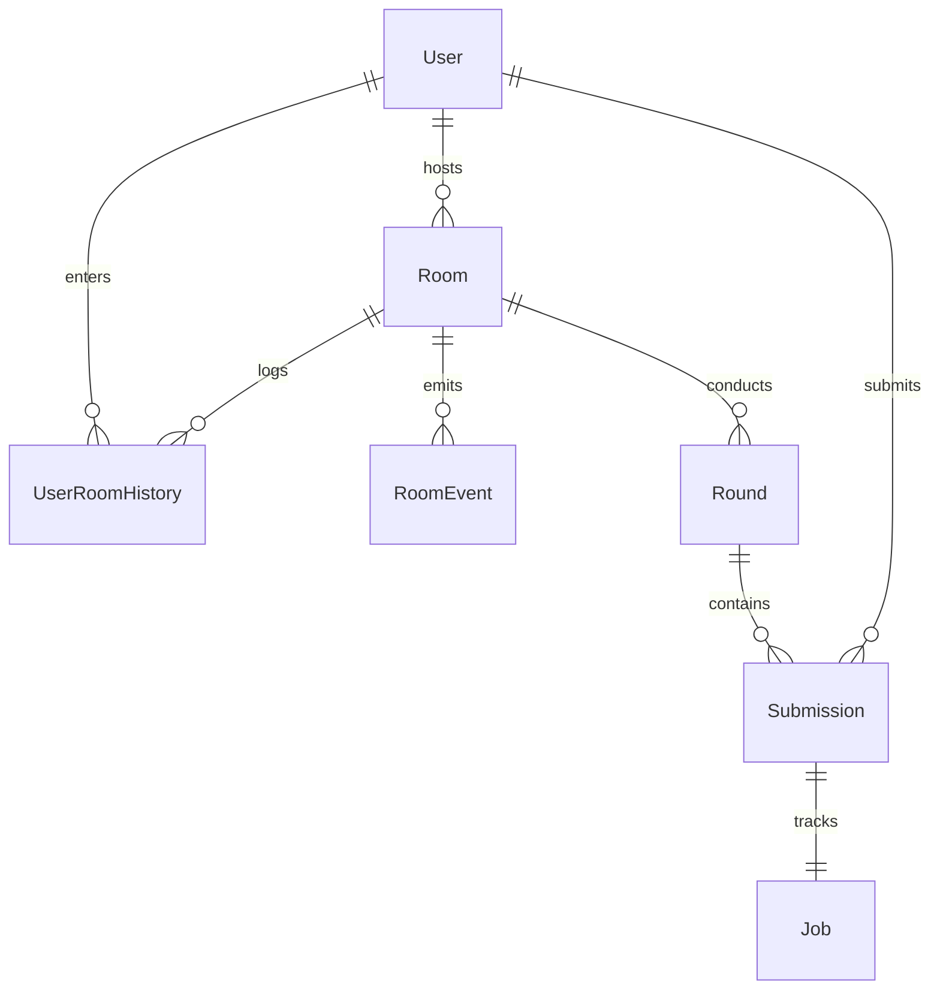
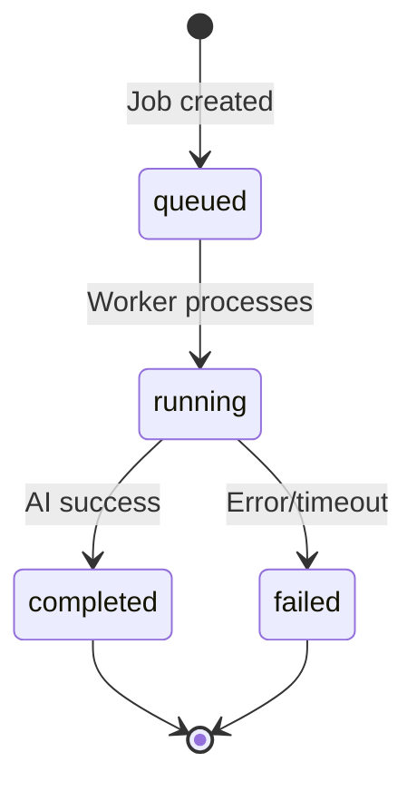

# Prompt Arena

A stateful, real-time multiplayer creative arena where participants submit prompts that are processed asynchronously through background tasks and generated using LLM APIs. The host evaluates submissions and ranks participants across multiple rounds.

---

## Architecture

Backend: FastAPI + SQLAlchemy (SQLite) with Clean Architecture separation of concerns.
Frontend: React + Vite + TypeScript.

### Backend Structure

```
backend/app/
├── core/                    # Database engine & security
├── models/                  # SQLAlchemy ORM entities
├── schemas/                 # Pydantic DTO serialization
├── services/                # Business logic via service classes
│   ├── user_service.py
│   ├── room_service.py
│   ├── round_service.py
│   ├── submission_service.py
│   └── ai/                  # Modular AI provider layer
│       ├── base.py          # BaseAIProvider interface
│       ├── groq.py          # Groq provider
│       ├── openai.py        # OpenAI provider
│       ├── gemini.py        # Gemini provider
│       ├── mock.py          # Fallback mock provider
│       └── orchestrator.py   # Provider orchestration & fallback logic
├── api/                     # HTTP routes & WebSocket handlers
└── main.py                  # Application bootstrap
```

**Key Design Patterns:**
- **Service Classes**: Database logic encapsulated in service classes (`UserService`, `RoomService`, etc.) accepting `Session` in constructors for modularity and testability.
- **AI Orchestrator**: Unified interface (`BaseAIProvider`) with priority-cascading fallback: Groq → OpenAI → Gemini → Mock provider.

---

## Database Schema

SQLite database with SQLAlchemy ORM. Entity-Relationship diagram:



**Key Tables:**
- **User**: Credentials and profile data.
- **Room**: Battle arena instance with host and unique invite code.
- **Round**: Round configuration and theme for the active battle.
- **Submission**: User prompt and generated output with scores.
- **Job**: Async task status, timestamps, and error tracking.
- **RoomEvent**: Event log for battle telemetry.
- **UserRoomHistory**: Tracks participant visit history.

---

## Real-time Events (WebSocket)

Communication via WebSocket at `/ws/room/{room_code}`:

| Event | Direction | Trigger | Description |
| :--- | :--- | :--- | :--- |
| `ROOM_STATE` | Server → Client | Connect/Refresh | Current game state snapshot |
| `USER_JOINED` | Server → Room | Join | User connected to room |
| `USER_LEFT` | Server → Room | Disconnect | User left room |
| `ROUND_STARTED` | Server → Room | Host | New round active, submissions open |
| `SUBMISSION_SUBMITTED` | Server → Room | Participant | Prompt submitted, async job queued |
| `JOB_STATUS_UPDATED` | Server → Room | Worker | Job status changed (running/failed) |
| `SUBMISSION_COMPLETED` | Server → Room | Worker | AI generation complete, results ready |
| `ROUND_EVALUATING` | Server → Room | Host | Submission phase closed |
| `SUBMISSION_SCORED` | Server → Room | Host | Submission ranked and scored |
| `ROUND_COMPLETED` | Server → Room | Host | Round finalized |
| `BATTLE_COMPLETED` | Server → Room | Host | Battle concluded |

---

## Job Lifecycle

Async task submission flows through:



- **queued**: Prompt persisted to database, added to processing queue.
- **running**: Worker begins AI generation.
- **completed**: Result stored and broadcast to clients.
- **failed**: Error logged (30s timeout, API error, safety filter).

---

## Persistence Model

**Persisted (Database):**
- User credentials, rooms, rounds, submissions, AI-generated content, job status, event logs.

**In-Memory Only:**
- Active WebSocket connections (lost on server restart).
- Queued jobs (incomplete jobs reset, but can be rerun from saved state).

---

## Error Handling

- **AI Failures**: Automatic fallback cascade through active providers (Groq → OpenAI → Gemini → Mock). If all fail or `FORCE_MOCK_AI=true`, mock provider generates output.
- **Safety Filters**: Blocked prompts marked as failed with user-readable error.
- **Timeouts**: 30-second hard limit per task; exceeded tasks transition to `timed_out`.
- **WebSocket Recovery**: Frontend auto-reconnects and requests full state snapshot on disconnect.

---

## Local Development

**Prerequisites:** Python 3.12+, Node.js 18+

**Backend:**
```powershell
cd backend
python -m venv venv
.\venv\Scripts\Activate.ps1
pip install -r requirements.txt
python -m uvicorn app.main:app --reload --host 0.0.0.0 --port 8000
```

**Frontend:**
```powershell
cd frontend
npm install
npm run dev -- --host 0.0.0.0
```
Open [http://localhost:5173](http://localhost:5173)

**Tests:**
```powershell
cd backend
.\venv\Scripts\Activate.ps1
pytest test_battle.py -v
```

---

## Deployment

**Backend (FastAPI + SQLite):**
- Services with persistent storage: **Railway**
- Requires persistent volume for `arena_battle.db`
- Set environment variables: `DATABASE_URL`, `GROQ_API_KEY`, `OPENAI_API_KEY`, `GEMINI_API_KEY`, `JWT_SECRET`, `FORCE_MOCK_AI`
- Start command: `uvicorn app.main:app --host 0.0.0.0 --port $PORT`

**Frontend (React + Vite):**
- Static hosting: **Vercel**
- Build: `npm run build` → output to `dist/`
- Optional: Set `VITE_API_URL` and `VITE_WS_URL` for backend connection


